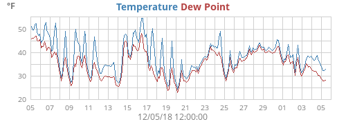
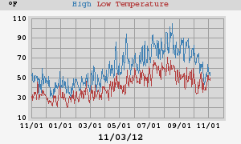
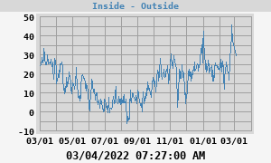
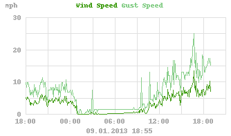
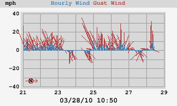

# The Image generator {#image_generator}

WeeWX is configured to generate a set of useful plots. But, what if you don't
like how they look, or you want to generate different plots, perhaps with
different aggregation types?

The Image generator is controlled by the configuration options in the
reference [_[ImageGenerator]_](../../reference/skin-options/imagegenerator).

These options are specified in the `[ImageGenerator]` section of a skin
configuration file. Let's take a look at the beginning part of this section.
It looks like this:

``` ini
[ImageGenerator]
    ...
    image_width = 500
    image_height = 180
    image_background_color = #f5f5f5

    chart_background_color = #d8d8d8
    chart_gridline_color = #a0a0a0
    ...
```

The options directly under the section name `[ImageGenerator]` will apply to
*all* plots, unless overridden in subsections. So, unless otherwise changed,
all plots will be 500 pixels in width, 180 pixels in height, and will have an
RGB background color of `#f5f5f5`, a very light gray (HTML color "WhiteSmoke").
The chart itself will have a background color of `#d8d8d8` (a little darker
gray), and the gridlines will be `#a0a0a0` (still darker). The other options
farther down (not shown) will also apply to all plots.

## Time periods

After the "global" options at the top of section `[ImageGenerator]`, comes a
set of sub-sections, one for each time period (day, week, month, and year).
These sub-sections define the nature of aggregation and plot types for that
time period. For example, here is a typical set of options for sub-section
`[[month_images]]`. It controls which "monthly" images will get generated,
and what they will look like:

``` ini
    [[month_images]]
        x_label_format = %d
        bottom_label_format = %m/%d/%y %H:%M
        time_length = 2592000    # == 30 days
        aggregate_type = avg
        aggregate_interval = 3h
        show_daynight = false
```

The option `x_label_format` gives a
[strftime()](https://docs.python.org/3/library/datetime.html#strftime-strptime-behavior)
type format for the x-axis. In this example, it will only show days
(format option `%d`). The `bottom_label_format` is the
format used to time stamp the image at the bottom. In this example, it
will show the time as something like `10/25/09 15:35`. A plot
will cover a nominal 30 days, and all items included in it will use an
aggregate type of averaging over 3 hours. Finally, by setting option
`show_daynight` to `false`, we are requesting that
day-night, shaded bands not be shown.

## Image files

Within each time period sub-section is another nesting, one for each
image to be generated. The title of each sub-sub-section is the filename
to be used for the image. Finally, at one additional nesting level (!)
are the logical names of all the line types to be drawn in the image.
Like elsewhere, the values specified in the level above can be
overridden. For example, here is a typical set of options for
sub-sub-section `[[[monthrain]]]`:

``` ini
        [[[monthrain]]]
            plot_type = bar
            yscale = None, None, 0.02
            [[[[rain]]]]
                aggregate_type = sum
                aggregate_interval = 1d
                label = Rain (daily total)
```

This will generate an image file with name `monthrain.png`. It
will be a bar plot. Option `yscale` controls the y-axis scaling
&mdash; if left out, the scale will be chosen automatically. However, in
this example we are choosing to exercise some degree of control by
specifying values explicitly. The option is a 3-way tuple
(`ylow`, `yhigh`, `min_interval`), where
`ylow` and `yhigh` are the minimum and maximum y-axis
values, respectively, and `min_interval` is the minimum tick
interval. If set to `None`, the corresponding value will be
automatically chosen. So, in this example, the setting

``` ini
yscale = None, None, 0.02
```

will cause WeeWX to pick sensible y minimum and maximum values, but
require that the tick increment (`min_interval`) be at least
0.02.

Continuing on with the example above, there will be only one plot
"line" (it will actually be a series of bars) and it will have logical
name `rain`. Because we have not said otherwise, the database
column name to be used for this line will be the same as its logical
name, that is, `rain`, but this can be overridden. The
aggregation type will be summing (overriding the averaging specified in
sub-section `[[month_images]]`), so you get the total rain
over the aggregate period (rather than the average) over an aggregation
interval of 86,400 seconds (one day). The plot line will be titled with
the indicated label of 'Rain (daily total)'. The result of all this is
the following plot:


## Including more than one type in a plot

More than one observation can be included in a plot. For example, here
is how to generate a plot with the week's outside temperature as well
as dewpoint:

``` ini
[[[monthtempdew]]]
    [[[[outTemp]]]]
    [[[[dewpoint]]]]
```

This would create an image in file `monthtempdew.png` that
includes a line plot of both outside temperature and dewpoint:



### Including a type more than once in a plot {#including_same_sql_type_2x}

Another example. Suppose that you want a plot of the day's temperature,
overlaid with hourly averages. Here, you are using the same data type
(`outTemp`) for both plot lines, the first with averages, the
second without. If you do the obvious it won't work:

``` ini
# WRONG ##
[[[daytemp_with_avg]]]
    [[[[outTemp]]]]
        aggregate_type = avg
        aggregate_interval = 1h
    [[[[outTemp]]]]  # OOPS! The same section name appears more than once!
```

The option parser does not allow the same section name (`outTemp`
in this case) to appear more than once at a given level in the
configuration file, so an error will be declared (technical reason:
formally, the sections are an unordered dictionary). If you wish for the
same observation to appear more than once in a plot then there is a
trick you must know: use option `data_type`. This will override
the default action that the logical line name is used for the database
column. So, our example would look like this:

``` ini
[[[daytemp_with_avg]]]
    [[[[avgTemp]]]]
        data_type = outTemp
        aggregate_type = avg
        aggregate_interval = 1h
        label = Avg. Temp.
    [[[[outTemp]]]]
```

Here, the first plot line has been given the name `avgTemp` to
distinguish it from the second line `outTemp`. Any name will do
&mdash; it just has to be different. We have specified that the first line
will use data type ` outTemp` and that it will use averaging over
a one hour period. The second also uses `outTemp`, but will not
use averaging.

The result is a nice plot of the day's temperature, overlaid with a one-hour
smoothed average:


One more example. This one shows daily high and low temperatures for a
year:

``` ini
[[year_images]]
    [[[yearhilow]]]
        [[[[hi]]]]
            data_type = outTemp
            aggregate_type = max
            label = High
        [[[[low]]]]
            data_type = outTemp
            aggregate_type = min
            label = Low Temperature
```

This results in the plot `yearhilow.png`:




## Including arbitrary expressions {#arbitrary_expressions_in_plot}

The option `data_type` can actually be *any arbitrary SQL
expression* that is valid in the context of the available types in the
schema. For example, say you wanted to plot the difference between
inside and outside temperature for the year. This could be done with:

``` ini
[[year_images]]
    [[[yeardiff]]]
        [[[[diff]]]]
            data_type = inTemp-outTemp
            label = Inside - Outside
```

Note that the option `data_type` is now an expression
representing the difference between `inTemp` and
`outTemp`, the inside and outside temperature, respectively. This
results in a plot `yeardiff.png`:



## Changing the unit used in a plot

Normally, the unit used in a plot is set by the unit group of the
observation types in the plot. For example, consider this plot of
today's outside temperature and dewpoint:

``` ini
    [[day_images]]
        ...
        [[[daytempdew]]]
            [[[[outTemp]]]]
            [[[[dewpoint]]]]
```

Both `outTemp` and `dewpoint` belong to unit group
`group_temperature`, so this plot will use whatever unit has been specified
for that group. See the section [*Mixed units*](../custom-reports/#mixed-units)
for details.

However, supposed you'd like to offer both Metric and US Customary
versions of the same plot? You can do this by using option
[`unit`](../../reference/skin-options/imagegenerator/#unit)
to override the unit used for individual plots:

``` ini hl_lines="4 9"
    [[day_images]]
        ...
        [[[daytempdewUS]]]
            unit = degree_F
            [[[[outTemp]]]]
            [[[[dewpoint]]]]

        [[[daytempdewMetric]]]
            unit = degree_C
            [[[[outTemp]]]]
            [[[[dewpoint]]]]
```

This will produce two plots: file `daytempdewUS.png` will be in
degrees Fahrenheit, while file `dayTempMetric.png` will use
degrees Celsius.

## Line gaps {#line_gaps}

If there is a time gap in the data, the option
[`line_gap_fraction`](../../reference/skin-options/imagegenerator/#line_gap_fraction) controls how line plots will be drawn.
Here's what a plot looks like without and with this option being specified:

|  |
|---------------------------------------------------|
| No `line_gap_fraction` specified                  |


|                                         |
|--------------------------------------------------------------------------------------|
| With `line_gap_fraction=0.01`.<br/>Note how each line has been split into two lines. |

## Progressive vector plots

WeeWX can produce progressive vector plots as well as the more
conventional x-y plots. To produce these, use plot type `vector`.
You need a vector type to produce this kind of plot. There are two:
`windvec`, and `windgustvec`. While they do not actually
appear in the database, WeeWX understands that they represent special
vector-types. The first, `windvec`, represents the average wind
in an archive period, the second, `windgustvec` the max wind in
an archive period. Here's how to produce a progressive vector for one
week that shows the hourly biggest wind gusts, along with hourly
averages:

``` ini
[[[weekgustoverlay]]]
    aggregate_interval = 1h
    [[[[windvec]]]]
        label = Hourly Wind
        plot_type = vector
        aggregate_type = avg
    [[[[windgustvec]]]]
        label = Gust Wind
        plot_type = vector
        aggregate_type = max
```

This will produce an image file with name `weekgustoverlay.png`.
It will consist of two progressive vector plots, both using hourly
aggregation (3,600 seconds). For the first set of vectors, the hourly
average will be used. In the second, the max of the gusts will be used:



By default, the sticks in the progressive wind plots point towards the
wind source. That is, the stick for a wind from the west will point
left. If you have a chronic wind direction (as I do), you may want to
rotate the default direction so that all the vectors do not line up over
the x-axis, overlaying each other. Do this by using option
`vector_rotate`. For example, with my chronic westerlies, I set
`vector_rotate` to 90.0 for the plot above, so winds out of the
west point straight up.

If you use this kind of plot (the out-of-the-box version of WeeWX
includes daily, weekly, monthly, and yearly progressive wind plots), a
small compass rose will be put in the lower-left corner of the image to
show the orientation of North.

## Overriding values

Remember that values at any level can override values specified at a
higher level. For example, say you want to generate the standard plots,
but for a few key observation types such as barometer, you want to also
generate some oversized plots to give you extra detail, perhaps for an
HTML popup. The standard `skin.conf` file specifies plot size of
300x180 pixels, which will be used for all plots unless overridden:

``` ini
[ImageGenerator]
    ...
    image_width = 300
    image_height = 180
```

The standard plot of barometric pressure will appear in
`daybarometer.png`:

``` ini
[[[daybarometer]]]
    [[[[barometer]]]] 
```

We now add our special plot of barometric pressure, but specify a larger
image size. This image will be put in file
`daybarometer_big.png`.

``` ini
[[[daybarometer_big]]]
    image_width  = 600
    image_height = 360
    [[[[barometer]]]]
```
