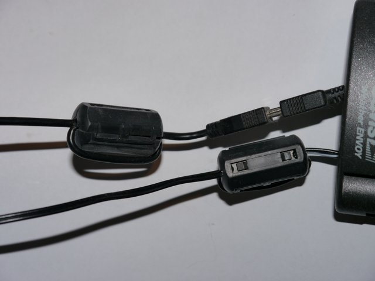

# Hardware problems

## Tips on making a system reliable

If you are having problems keeping your weather station up for long periods of
time, here are some tips, in decreasing order of importance:

* Run on dedicated hardware. If you are using the server for other tasks,
  particularly as your desktop machine, you will have reliability problems. If
  you are using it as a print or network server, you will probably be OK.

* Run headless. Modern graphical systems are extremely complex. As new features
  are added, test suites do not always catch up. Your system will be much more
  reliable if you run it without a windowing system.

* Use an Uninterruptible Power Supply (UPS). The vast majority of power glitches
  are very short-lived &mdash; just a second or two &mdash; so you do not need a
  big one. The 425VA unit I use to protect my fit-PC cost $55 at Best Buy.

* If you buy a Davis VantagePro and your computer has an old-fashioned serial
  port, get the VantagePro with a serial connection, not a USB connection. See
  the Wiki article on [Davis cp2101 converter
  problems](https://github.com/weewx/weewx/wiki/Troubleshooting-the-Davis-Vantage-station#davis-cp2101-converter-problems)
  for details.

* If you do use a USB connection, put a ferrite coil on each end of the cable to
  your console. If you have enough length and the ferrite coil is big enough,
  make a loop, so it goes through the coil twice. See the picture below:

<figure markdown>
  { width="300" }
  <figcaption>Cable connection looped through a ferrite coil
Ferrite coils on a Davis Envoy. There are two coils, one on the USB connection 
(top wire) and one on the power supply. Both have loops.</figcaption>
</figure>


## Archive interval

Most hardware with data-logging includes a parameter to specify the archive
interval used by the logger. If the hardware and driver support it, WeeWX will
use this interval as the archive interval. If not, WeeWX will fall back to using
option `archive_interval` specified in
[[StdArchive]](../../../reference/weewx-options/stdarchive/). The default 
fallback value is 300 seconds (5 minutes).

If the hardware archive interval is large, it will take a long time before
anything shows up in the WeeWX reports. For example, WS23xx stations ship with
an archive interval of 60 minutes, and Fine Offset stations ship with an archive
interval of 30 minutes. If you run WeeWX with a WS23xx station in its factory
default configuration, it will take 60 minutes before the first data point shows
up, then another 60 minutes until the next one, and so on.

Since reports are generated when a new archive record arrives, a large archive
interval means that reports will be generated infrequently.

If you want data and reports closer to real-time, use the
[weectl device](../../../utilities/weectl-device) utility to change the 
interval.


## Raspberry Pi

WeeWX runs very well on the Raspberry Pi, from the original Model A and Model B,
to the latest incarnations. However, the Pi does have some quirks, including
issues with USB power and lack of a clock.

See the [Wiki](https://github.com/weewx/weewx/wiki) for up-to-date information
on [Running WeeWX on a Raspberry
Pi](https://github.com/weewx/weewx/wiki/Raspberry%20Pi).


## Davis stations

For Davis-specific tips, see the Wiki article [Troubleshooting Davis
stations](https://github.com/weewx/weewx/wiki/Troubleshooting-the-Davis-Vantage-station)


## Fine Offset USB lockups

The Fine Offset series weather stations and their derivatives are a fine value
and can be made to work reasonably reliably, but they have one problem that is
difficult to work around: the USB can unexpectantly lock up, making it
impossible to communicate with the console. The symptom in the log will look
something like this:

```
Jun 7 21:50:33 localhost weewx[2460]: fousb: get archive interval failed attempt 1 of 3: could not detach kernel driver from interface 0: No data available
```

The exact error may vary, but the thing to look for is the **"could not detach
kernel driver"** message. Unfortunately, we have not found a software cure for
this. Instead, you must power cycle the unit. Remove the batteries and unplug
the USB, then put it back together. No need to restart WeeWX.

More details about [Fine Offset
lockups](https://github.com/weewx/weewx/wiki/FineOffset%20USB%20lockup) can be
found in the [Wiki](https://github.com/weewx/weewx/wiki).
